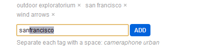
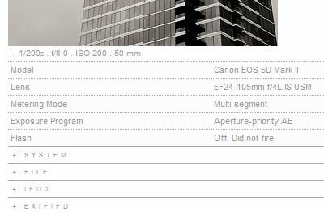
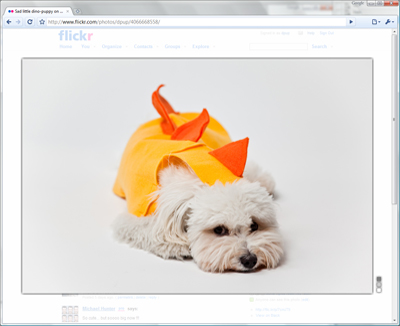
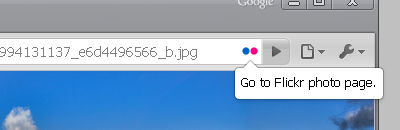
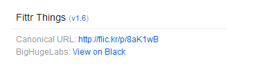

# Fittr Flickr

*Note: given Flickr's redesigns this extension is mostly defunct. This is a migration from Google Code, which is shutting down.*

--

Chrome extension for enhancing the awesome photo sharing site, [Flickr](http://www.flickr.com).

Visit the [Chrome Extensions Gallery](https://chrome.google.com/extensions/detail/fhaledancjhefginmkkondfjpnkhdglh) to install the latest stable release.

Or [click here](./fittr-flickr.crx) for the _beta_ installer, where updates and bug fixes will be tried out before they get pushed to the gallery.

*NOTE: If you installed the beta version from this site please make sure you have at least version 1.5.1, if you don't please reinstall from the above link.  I messed the auto-update while going back and forth between the chrome.google.com release and the beta.*

--

## Keyboard shortcuts

Type `?` at any time to see what shortcuts are available.  Among other things they allow for more convenient navigation.

--

## Tag Autocomplete

Inline autocomplete shows you your most popular tag that matches the prefix you've already entered.

--

## Easy EXIF

Basic camera information show below the photo.  Quick access to all EXIF properties by clicking and expanding the section.

--

## Lightbox

Press L or click on an image to get a better view of the image without changing pages.

--

## Goto Flickr Page Action

Often times people don't correctly link to Flickr photos.  When viewing a raw Flickr image an icon will show up in the Omnibox that will take you to it's Flickr page. 

--

## Short URL and BHL

A link the the [http://www.bighugelabs.com BigHugeLabs] Scout page is added to the photostream and profile links.  A View On Black link is added on the right-hand side along with the short Flic.kr URL, just click it to copy to your clipboard.

